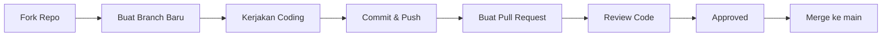

# Panduan Kontribusi (Contributing Guide)

Terima kasih atas minat Anda untuk berkontribusi pada pengembangan **Kalkulator Desktop PyQt6** (`calculator-pemdes`).

Untuk menjaga kerapian repositori dan kelancaran alur kolaborasi tim, seluruh kontribusi wajib mengikuti alur kerja (*Git Workflow*) dan aturan baku di bawah ini.

---

## Alur Kerja Utama (Workflow Rules)

Setiap kontributor wajib mengikuti alur baku berikut:



> **Aturan Wajib:**
> **Buat branch baru** -> **Kerjakan** -> **Push** -> **Pull Request** -> **Review** -> **Approved** -> **Merge ke main**
>
> *(Dilarang melakukan push atau commit langsung ke branch `main` repositori utama).*

---

## Langkah-Langkah Berkontribusi

Ikuti 8 langkah praktis berikut untuk mulai berkontribusi:

### 1. Fork Repositori
Buka halaman repositori utama di GitHub: [rotistorage-boop/calculator-pemdes](https://github.com/rotistorage-boop/calculator-pemdes) lalu klik tombol **Fork** di pojok kanan atas untuk menduplikasi repo ke akun GitHub pribadi Anda.

---

### 2. Clone Fork Anda ke Komputer Lokal
Salin hasil fork repositori ke komputer lokal Anda:

```bash
git clone https://github.com/rotistorage-boop/calculator-pemdes
```

---

### 3. Masuk ke Direktori Proyek
Buka terminal dan navigasikan ke dalam folder proyek:

```bash
cd calculator-pemdes
```

---

### 4. Buat dan Pindah ke Branch Baru
Selalu buat branch baru yang deskriptif sesuai fitur atau perbaikan yang akan dikerjakan:

```bash
git switch -c feature/nama-fitur
```

> **Konvensi Penamaan Branch:**
> - `feature/nama-fitur` : Untuk penambahan fitur baru (contoh: `feature/layout-tab-vbox`, `feature/logic-akar`).
> - `fix/nama-perbaikan` : Untuk perbaikan bug atau error (contoh: `fix/division-by-zero`).
> - `refactor/nama-refactor` : Untuk perapian struktur kode tanpa mengubah fungsionalitas.
> - `docs/nama-dokumen` : Untuk pembaruan dokumentasi (contoh: `docs/update-readme`).

---

### 5. Kerjakan Coding & Pengujian
- Implementasikan fitur sesuai ketentuan tugas/proyek dan modul yang relevan (`ui/`, `logic/`, `assets/`, dll.).
- Pastikan lingkungan virtual Python aktif dan dependensi terpasang:
  ```powershell
  # Menjalankan skrip setup virtual environment
  .\setup.ps1
  ```
- Jalankan aplikasi dan pastikan tidak ada pesan error sebelum melakukan commit:
  ```bash
  python main.py
  ```

---

### 6. Simpan Perubahan (Git Add & Commit)
Stage perubahan dan buat pesan commit yang jelas menggunakan format *Conventional Commits*:

```bash
git add .
git commit -m "feat: nama fitur"
```

> **Format Pesan Commit yang Disarankan:**
> - `feat: <deskripsi>` : Menambahkan fitur baru.
> - `fix: <deskripsi>` : Memperbaiki bug.
> - `docs: <deskripsi>` : Perubahan pada dokumentasi.
> - `style: <deskripsi>` : Perubahan format atau tata letak visual tanpa mengubah logika.
> - `refactor: <deskripsi>` : Restrukturisasi kode.

---

### 7. Push Branch ke Repositori Fork Anda
Unggah branch fitur Anda ke repositori fork di GitHub:

```bash
git push -u origin feature/nama-fitur
```

---

### 8. Buat Pull Request (PR)
1. Buka repositori fork Anda di GitHub.
2. Klik tombol **Compare & pull request**.
3. Pastikan konfigurasi target merge sudah benar:
   - **Base repository (Target)**: `rotistorage-boop/calculator-pemdes` -> branch `main`
   - **Head repository (Source)**: `<username-anda>/calculator-pemdes` -> branch `feature/nama-fitur`
4. Berikan judul dan deskripsi PR yang informatif mengenai perubahan yang dilakukan.
5. Tunggu proses **Review** dan **Approval** dari tim atau maintainer sebelum branch di-merge ke `main`.

---

## Checklist Sebelum Mengajukan Pull Request

Sebelum menekan tombol *Create Pull Request*, pastikan:
- [ ] Kode sudah diuji dan berjalan lancar tanpa error (`python main.py`).
- [ ] Penamaan branch dan pesan commit sudah mengikuti konvensi.
- [ ] Tidak ada file cache (`__pycache__`, `.venv`) yang ikut ter-commit.
- [ ] Kode ditulis secara rapi dan mengikuti struktur modular proyek (`logic/` terpisah dari `ui/`).

---

Terima kasih atas kerja samanya dan selamat berkontribusi!
