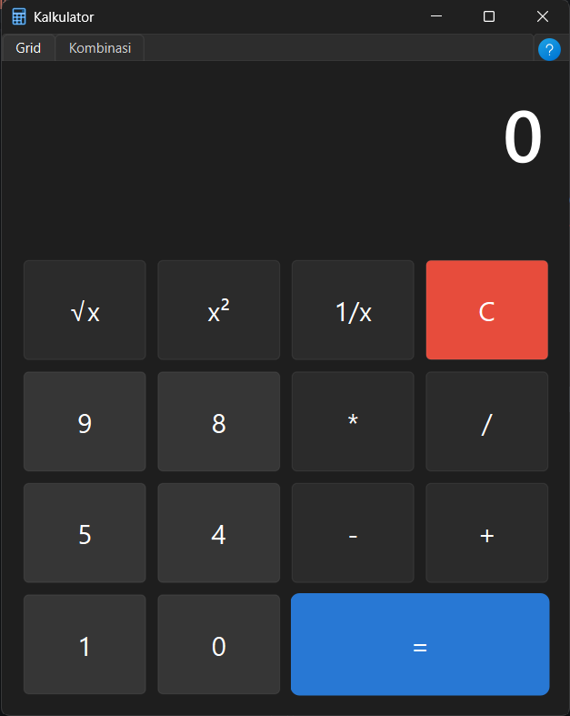

# Kalkulator Desktop PyQt6 - UTS Pemrograman Desktop

Aplikasi kalkulator GUI desktop pakai Python dan PyQt6 sesuai spesifikasi UTS Pemrograman Desktop.

## Preview Aplikasi



---

## Checklist Fitur UTS

| No | Komponen | Bobot | Status |
|----|----------|-------|--------|
| 1 | Tombol NIM (0, 1, 4, 5, 8, 9) | 10 | ✅ |
| 2 | Tombol Operasi Math dan Clear (+, -, *, /, =, C, √x, x², 1/x) | 10 | ✅ |
| 3 | Tab (QTabWidget: Tab Grid & Tab Kombinasi) | 10 | ✅ |
| 4 | Grid (QGridLayout di Tab 1) | 10 | ✅ |
| 5 | Kombinasi VBox dan HBox (QVBoxLayout + QHBoxLayout di Tab 2) | 10 | ✅ |
| 6 | LineEdit (QLineEdit read-only untuk display hasil) | 10 | ✅ |
| 7 | Tampilan tombol rapat (spacing 8px, margin minimal) | 10 | ✅ |
| 8 | Menu (popup menu navigasi tab dari ikon pojok kanan atas) | 10 | ✅ |
| 9 | Shortcut menu (Ctrl+1 untuk Tab Grid, Ctrl+2 untuk Tab Kombinasi) | 10 | ✅ |
| 10 | Operasi Matematika betul (tambah, kurang, kali, bagi, akar, kuadrat, invers, clear) | 10 | ✅ |

> Framework: **PyQt6** ✅

---

## Struktur Folder

```text
UTS/
|-- assets/
|   |-- icons/
|   |   `-- calculator.png       # Ikon aplikasi
|   `-- preview.png              # Tampilan preview kalkulator
|-- logic/
|   `-- calculator.py            # Logika perhitungan matematika
|-- ui/
|   |-- display.py               # Widget layar display (QLineEdit)
|   |-- keypad_grid.py           # Keypad pakai QGridLayout (Tab 1)
|   |-- keypad_combo.py          # Keypad pakai VBox + HBox (Tab 2)
|   `-- main_window.py           # Jendela utama, tab, menu, shortcut
|-- ref/                         # File referensi desain
|-- .gitignore
|-- CONTRIBUTING.md              # Panduan kontribusi & Git workflow
|-- main.py                      # File utama untuk jalankan app
|-- requirements.txt             # Dependensi (PyQt6)
|-- setup.ps1                    # Script setup otomatis
`-- README.md
```

---

## Penjelasan Singkat Kode

### main.py
Titik awal program. Buat `QApplication`, tampilkan `MainWindow`, jalankan event loop.

### ui/main_window.py
Jendela utama (`QMainWindow`). Atur judul, ikon, ukuran window. Buat `QTabWidget` dengan 2 tab:
- **Tab Grid** — keypad pakai `QGridLayout`
- **Tab Kombinasi** — keypad pakai `QVBoxLayout` + `QHBoxLayout`

Fitur tambahan:
- Ikon bantuan di pojok kanan atas tab (posisi pas di tengah) yang menampilkan popup menu navigasi tab.
- Shortcut keyboard `Ctrl+1` dan `Ctrl+2` untuk pindah tab.

### ui/display.py
Widget display pakai `QLineEdit` read-only. Teks rata kanan, font 48pt, tanpa border.

### ui/keypad_grid.py
Keypad Tab 1 pakai `QGridLayout`. Tombol angka NIM (0,1,4,5,8,9), operator (+,-,*,/), fungsi (√x, x², 1/x), Clear (C), dan sama dengan (=). Tombol C merah, tombol = biru, tombol angka gelap.

### ui/keypad_combo.py
Keypad Tab 2 pakai kombinasi `QVBoxLayout` dan `QHBoxLayout`. Tombol sama seperti Tab 1, disusun per baris pakai `QHBoxLayout` di dalam `QVBoxLayout`. Tombol = lebar 2x.

### logic/calculator.py
Logika backend kalkulator. Proses input angka, operator, hitung hasil (+,-,*,/), akar kuadrat, kuadrat, invers (1/x), dan clear. Ada penanganan error bagi nol dan format angka.

---

## Cara Menjalankan

1. Setup environment (jika belum):
   ```powershell
   .\setup.ps1
   ```
2. Aktivasi Virtual Environment:
   ```powershell
   .\.venv\Scripts\Activate.ps1
   ```
3. Jalankan app:
   ```powershell
   python main.py
   ```
